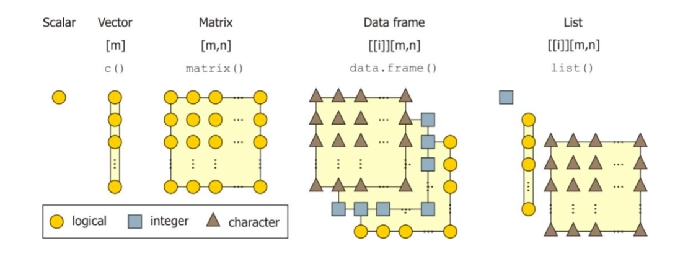
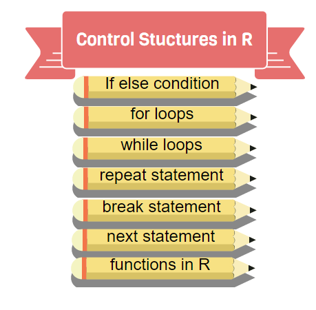
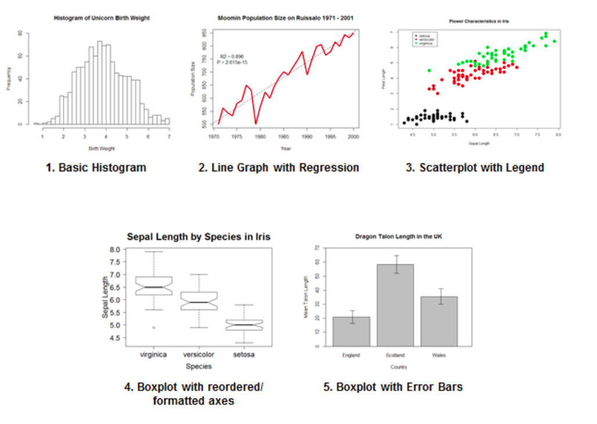
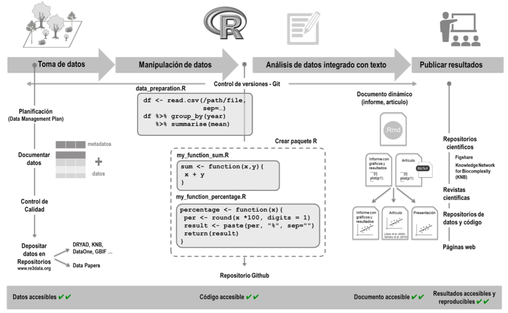

## Breve repaso

```{r, echo = FALSE, eval = T, message=FALSE, width = "50%"}
library(knitr)

```

[A practical guide to the R package Luminescence (Dietze et al., 2013)](https://hal.archives-ouvertes.fr/hal-01846155/document)

## Breve repaso

```{r, echo = FALSE, eval = T, message=FALSE, out.width = "70%", fig.align='center'}
library(knitr)

```

[Control Structures in R (R-Bloggers)](https://www.r-bloggers.com/control-structures-loops-in-r/)

## Breve repaso

```{r, echo = FALSE, eval = T, message=FALSE, width = "50%"}
library(knitr)
knitr::include_graphics('bioconductor_logo_rgb.jpg')
```

## Breve repaso

```{r, echo = FALSE, eval = T, message=FALSE, width = "50%"}
library(knitr)

```

[R Base Graphs: an Idiot's Guide](https://rpubs.com/SusanEJohnston/7953)

## Análisis reproducible
```{r, echo = FALSE, eval = T, message=FALSE, width = "50%"}
library(knitr)
knitr::include_graphics('gradiente_reproducibilidad.png')

```

[Reproducible Research in Computational Science (Peng, 2012)](https://www.ncbi.nlm.nih.gov/pmc/articles/PMC3383002/)

## Análisis reproducible 

```{r, echo = FALSE, eval = T, message=FALSE, width = "50%"}
library(knitr)
knitr::include_graphics('analytic_process.png')

```

[Data Wrangling with R (Boehmke, 2016)](http://93.174.95.29/_ads/6F902E466A32011DD94E2B6EEE505F9F)

## Análisis reproducible en R

```{r, echo = FALSE, eval = T, message=FALSE, width = "50%"}
library(knitr)


```

[Ciencia reproducible: qué, por qué, cómo (Rodríguez-Sánchez et al., 2016)]()

## Estructura de las clases

- Teórico/práctico.
- Práctico 11: repaso de loops y armado de funciones en R
- Práctico 12: manejo de datos con paquetes de la librería **tidyverse**.

## Manejo de datos
- ***Data wrangling***: es el proceso mediante el cual modificamos datos iniciales con el fin de analizarlos.

## Manejo de datos
- ***Data wrangling***: es el proceso mediante el cual modificamos datos iniciales con el fin de analizarlos.
- Incluye la edición, el filtrado, la obtención de nuevos y valores y más.

## Manejo de datos
- ***Data wrangling***: es el proceso mediante el cual modificamos datos iniciales con el fin de analizarlos.
- Incluye la edición, el filtrado, la obtención de nuevos y valores y más.
- *"In our experience, the tasks of exploratory data mining and data cleaning constitute 80% of the effort that determines 80% of the value of the ultimate data mining results. (...)"*. **Dasu & Johnson.** *Exploratory Data Mining and Data Cleaning* (2003).


## Manejo de datos

Esto generalmente incluye

- Práctico 11
  + accionar sobre los datos para transformarlos: funciones
  + realizar acciones repetitivas: loops

- Práctico 12
  + filtrado y edición de datos 
  + visualización de los datos

# Funciones en R

## Funciones: una parte central de R

- Es un lenguaje de programación en base a funciones: casi todo lo que hacemos las utiliza.
  - Otros lenguajes operan de forma diferente.
- R tiene funciones que vienen incorporadas por defecto
- Utilizando librerías obtenemos nuevas funciones (como las de **seqinr**, por ejemplo)
- Nosotros podemos hacer nuestras propias funciones

## Pero... qué es una función?

- una definicion de función

## componentes de la funcion clasica
- **cuerpo**: el código dentro de la función
- **formales**: la lista de argumentos que controlan cómo se llama a la función
- **ambiente**: el "mapa" de la locación de las variables de la función
  
## componentes de la funcion clasica

```{r, echo = TRUE, eval = TRUE, message=TRUE, out.height="50%"}
library(seqinr)

body(seqinr::GC)
```

## componentes de la funcion clasica

```{r, echo = TRUE, eval = TRUE, message=TRUE}
library(seqinr)

formals(seqinr::GC)
```

## componentes de la funcion clasica

```{r, echo = TRUE, eval = TRUE, message=TRUE}
library(seqinr)

environment(seqinr::GC)
```

## R tiene varios tipos de funciones
- Podemos, además, distinguir tipos especiales de funciones:
  - **Funciones primitivas**: llaman directamente a C
    - No tienen cuerpo ni formales.
  - **Funciones de alto rango**: operan sobre funciones
    - Tienen cuerpo y formales, pero constituyen un caso interesante en sí

## funciones primitivas
```{r, echo = TRUE, eval = TRUE, message=TRUE}
sum

body(sum)
formals(sum)
environment(sum)
```

## funciones primitivas
```{r, echo = TRUE, eval = TRUE, message=TRUE}
`[`

`for`
```

## definiendo funciones en R

```{r, echo = TRUE, eval = FALSE, message=FALSE}
mi_funcion = function(argumento_1, argumento_2, ...){
  # en este bloque suceden operaciones con argumento_1
  ...
  # en este bloque suceden operaciones con argumento_2
  ...
  # se devuelve algo como resultado de aplicar
  # la funcion a los argumentos
  return(una_variable_nueva)
}
```

## definiendo funciones en R
```{r, echo = TRUE, eval = TRUE, message=FALSE}
eleva_y_resta = function(x,y){
  resultado = x^2 - y^2
  return(resultado)
}
```

## definiendo funciones en R
```{r, echo = TRUE, eval = TRUE, message=FALSE}
eleva_y_resta = function(x,y){
  resultado = x^2 - y^2
  return(resultado)
}

eleva_y_resta(2,3)
```

## definiendo funciones en R
```{r, echo = TRUE, eval = TRUE, message=FALSE}
eleva_y_suma = function(x,y){
  resultado = x^2 + y^2
  return(resultado)
}

eleva_y_resta(y = 2, x =3)
```

## definiendo funciones en R
```{r setup, cache = F, eval = T, echo = F}
knitr::opts_chunk$set(error = TRUE)
```

```{r, echo = TRUE, eval = TRUE, message=TRUE}
eleva_y_suma = function(x,y){
  resultado = x^2 + y^2
  return(resultado)
}

eleva_y_resta(y = 2)
```

## definiendo funciones en R
```{r, echo = TRUE, eval = F, message=FALSE}
eleva_y_suma = function(x = 1, y =1){
  resultado = x^2 + y^2
  return(resultado)
}

eleva_y_resta(y = 2)
```

```{r, echo = F, eval = T, message=FALSE}
# ojo con el alcance de las variables!
x = 2
eleva_y_suma = function(x, y){
  resultado = x^2 + y^2
  return(resultado)
}

eleva_y_resta(x = 1, y = 2)
```

## definiendo funciones en R
```{r, echo = TRUE, eval = FALSE, message=FALSE}
# ojo con el alcance de las variables!
x = 2
eleva_y_suma = function(x, y){
  resultado = x^2 + y^2
  return(resultado)
}

eleva_y_resta(y = 2)
```

```{r, echo = F, eval = T, message=FALSE}
# ojo con el alcance de las variables!
x = 2
eleva_y_suma = function(x, y){
  resultado = x^2 + y^2
  return(resultado)
}

eleva_y_resta(x = 2, y = 2)
```

## Un ejemplo un poco más refinado
```{r, echo = TRUE, eval = TRUE, message=TRUE, size='tiny'}
# se arma una función arbitraria que evalúa si un número es par

evalua_par = function(numero){
  # si la variable numero no es de clase numeric devuelvo mensaje al usuario
  if(!is.numeric(numero)){
    return('Ingrese un numero')
  }
  
  else {
    # evaluo si numero es par, considerando el resto de dividirlo entre 2.
    resto = numero %% 2
    
    if(resto == 0){
      return(TRUE)
    }
    
    else {
      return(FALSE)
    }
  }
}

# evaluamos nuestra funcion
evalua_par("Texto")
evalua_par(numero = 4)
evalua_par(numero = 3)
```

## funciones de alto rango (*high-order functions*)

- Son funciones que toman a otras funciones como argumentos y devuelven una función o valor.
- Funciones como apply(), sapply(), lapply(), mapply()...

## sapply
```{r, echo = TRUE, eval = TRUE, message=TRUE, size='tiny'}
# definimos un vector
numeros = c(1,2,3,4)

# aplicamos una funcion anonima sobre este vector
numeros_cuadrado = sapply(X = numeros, FUN = function(x){x^2})

numeros_cuadrado
```

## lapply
```{r, echo = TRUE, eval = TRUE, message=TRUE, size='tiny'}
# definimos un vector
numeros = c(1,2,3,4)

# aplicamos una funcion anonima sobre este vector
numeros_cuadrado = lapply(X = numeros, FUN = function(x){x^2})

numeros_cuadrado
```

## mapply
```{r, echo = TRUE, eval = TRUE, message=FALSE}
# creando una matriz de 4x4 con mapply
matriz = mapply(rep, 1:4, 4)

matriz
```


# Loops en R

## loops

```{r, echo = TRUE, eval = FALSE, message=FALSE}
# for loop

un_vector = ...
for (i in ____) {
  ...
  ... un_vector[i] ....
  ...
}
```

## loops

```{r, echo = TRUE, eval = FALSE, message=FALSE}
# for loop

numeros = c(1,40,2,6)
numeros_cuadrado = c()

for (i in 1:length(numeros)) {
  numeros_cuadrado[i] = numeros[i]^2
}
```

## loops

```{r, echo = TRUE, eval = FALSE, message=FALSE}
# for loop

numeros = c(1,40,2,6)
numeros_cuadrado = c()

for (i in seq_along(numeros)) {
  numeros_cuadrado[i] = numeros[i]^2
}
```


