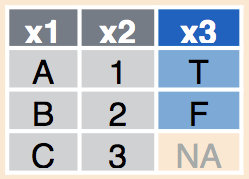
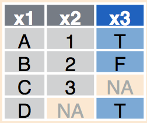

```{r, echo = F, eval = T}
library(knitr)
hook_output <- knit_hooks$get("output")
knit_hooks$set(output = function(x, options) {
  lines <- options$output.lines
  if (is.null(lines)) {
    return(hook_output(x, options))  # pass to default hook
  }
  x <- unlist(strsplit(x, "\n"))
  more <- "..."
  if (length(lines)==1) {        # first n lines
    if (length(x) > lines) {
      # truncate the output, but add ....
      x <- c(head(x, lines), more)
    }
  } else {
    x <- c(more, x[lines], more)
  }
  # paste these lines together
  x <- paste(c(x, ""), collapse = "\n")
  hook_output(x, options)
})

def.chunk.hook  <- knitr::knit_hooks$get("chunk")
knitr::knit_hooks$set(chunk = function(x, options) {
  x <- def.chunk.hook(x, options)
  ifelse(options$size != "normalsize", paste0("\n \\", options$size,"\n\n", x, "\n\n \\normalsize"), x)
})

``` 

```{r, eval = F, echo = F}
library(knitr)
hook_output = knit_hooks$get('output')
knit_hooks$set(output = function(x, options) {
  # this hook is used only when the linewidth option is not NULL
  if (!is.null(n <- options$linewidth)) {
    x = knitr:::split_lines(x)
    # any lines wider than n should be wrapped
    if (any(nchar(x) > n)) x = strwrap(x, width = n)
    x = paste(x, collapse = '\n')
  }
  hook_output(x, options)
})
```

```{r, echo = F, eval = T}
library(knitr)
error_hook <- knitr::knit_hooks$get("error")
knitr::knit_hooks$set(error = function(x, options) {
  if (!is.null(n <- options$linewidth)) {
    x = knitr:::split_lines(x)
    if (any(nchar(x) > n)) x = strwrap(x, width = n)
    x = paste(x, collapse = '\n')
  }
  error_hook(x, options)
})
```

## Slide con muchos tipos de graficos


## Análisis reproducible 

```{r, echo = FALSE, eval = T, message=FALSE, width = "50%"}
library(knitr)
knitr::include_graphics('analytic_process.png')

```

## Cuales son las operaciones que generalmente se hacen con los datos?
- Cargar datos *crudos*/Guardar datos finales y tablas de interés.
- Filtrar datos (con criterio).
- Unir datos que vienen de diferentes fuentes, referentes a un mismo conjunto estudiado.
- Hacer modificaciones: crear *tags*, correcciones ortográficas, filas y columnas de tablas, etc...
- Generar nuevos datos: obtener promedios, medianas, aplicar funciones de librerías.
- Dejar anotado y reportar lo hecho.

## Idea de lo que lleva hacer un grafico para hacerlo bien

## Que hay detras de hacer estos graficos en R? Muchas librerias, de las cuales un monton son del universo tidyverse.

## Los que no son de universo tidyverse igual tienen que ser retocadas generalmente, so... its good to learn tidyverse.

## 
\begin{tikzpicture}[remember picture,overlay]
  \node[anchor=south west,inner sep=0pt] at ($(current page.south west)+(0cm,7.8cm)$) {
     \includegraphics[width=1.5cm]{tidyverse.png}
  };
\end{tikzpicture}

```{r, echo = FALSE, eval = F, message=FALSE, width = "50%"}
library(knitr)
knitr::include_graphics('tidyverse.png')

```

```{r, echo = FALSE, eval = TRUE, message=FALSE}
library(knitr)

knitr::include_graphics('tidyverse_packages.png')
```

## 
\begin{tikzpicture}[remember picture,overlay]
  \node[anchor=south west,inner sep=0pt] at ($(current page.south west)+(0cm,7.8cm)$) {
     \includegraphics[width=1.5cm]{tibbles.png}
  };
\end{tikzpicture}


## tib
\begin{tikzpicture}[remember picture,overlay]
  \node[anchor=south west,inner sep=0pt] at ($(current page.south west)+(0cm,7.8cm)$) {
     \includegraphics[width=1.5cm]{tibbles.png}
  };
\end{tikzpicture}

```{r, echo = TRUE, eval = TRUE, message=FALSE, size = 'small'}
iris
```

## tibb
\begin{tikzpicture}[remember picture,overlay]
  \node[anchor=south west,inner sep=0pt] at ($(current page.south west)+(0cm,7.8cm)$) {
     \includegraphics[width=1.5cm]{tibbles.png}
  };
\end{tikzpicture}

```{r, echo = TRUE, eval = TRUE, message=FALSE, size = 'small'}
library(tibble)

as_tibble(iris)
```

## readr

\begin{tikzpicture}[remember picture,overlay]
  \node[anchor=south west,inner sep=0pt] at ($(current page.south west)+(0cm,7.8cm)$) {
     \includegraphics[width=1.5cm]{readr_logo.png}
  };
\end{tikzpicture}

```{r, echo = FALSE, eval = F, message=FALSE}
library(knitr)

knitr::include_graphics('readr_logo.png')
```

- read_csv() reads comma delimited files, read_tsv() reads tab delimited files, and read_delim() reads in files with any delimiter.
- read_fwf() reads fixed width files. You can specify fields either by their widths with fwf_widths() or their position with fwf_positions(). read_table() reads a common variation of fixed width files where columns are separated by white space.
- **These functions all have similar syntax: once you’ve mastered one, you can use the others with ease**

- Sometimes there are a few lines of metadata at the top of the file. You can use skip = n to skip the first n lines; or use comment = "#" to drop all lines that start with (e.g.) #.
- The data might not have column names. You can use col_names = FALSE to tell read_csv() not to treat the first row as headings, and instead label them sequentially from X1 to Xn
- Another option that commonly needs tweaking is na: this specifies the value (or values) that are used to represent missing values in your file

- They are **typically much faster (~10x)** than their base equivalents.
Long running jobs have a progress bar, so you can see what’s happening.
If you’re looking for raw speed, try `data.table::fread()`. It doesn’t fit
quite so well into the tidyverse, but it can be quite a bit faster.
- They **produce tibbles**, they **don’t convert character vectors to factors**,
use row names, or munge the column names. These are common sources of
frustration with the base R functions.
- **They are more reproducible.** Base R functions inherit some behaviour from
your operating system and environment variables, so import code that works
on your computer might not work on someone else’s.

- Levantar un ejemplo aca

## magrittr

```{r, echo = FALSE, eval = TRUE, message=FALSE}
library(knitr)

knitr::include_graphics('streamlining-with-magrittr.jpg')
```

## magrittr
\begin{tikzpicture}[remember picture,overlay]
  \node[anchor=south west,inner sep=0pt] at ($(current page.south west)+(0cm,7.8cm)$) {
     \includegraphics[width=1.5cm]{magrittr_log.jpg}
  };
\end{tikzpicture}

```{r, echo = FALSE, eval = F, message=FALSE}
library(knitr)

knitr::include_graphics('magrittr_log.jpg')
```

- Es el *pipe* de R.
- El uso es exactamente igual al '|' de Bash. 
- Un único detalle: se utiliza **.** para hacer referencia a resultados intermedios en un pipe.

```{r, echo = TRUE, eval = TRUE, message=FALSE}
# hacer operaciones con una columna sin magrittr.

# Forma 1
Sepal.Width = iris$Sepal.Width
Sepal.Width.Median = median(Sepal.Width)

# Forma 2
Sepal.Width.Median =  median(iris$Sepal.Width)

```

```{r, echo = TRUE, eval = TRUE, message=FALSE}
# con magrittr
library(magrittr)

Sepal.Width.Median = iris %>% .$Sepal.Width %>% median(.) 
```


## dpl
\begin{tikzpicture}[remember picture,overlay]
  \node[anchor=south west,inner sep=0pt] at ($(current page.south west)+(0cm,7.8cm)$) {
     \includegraphics[width=1.5cm]{dplyr.png}
  };
\end{tikzpicture}

```{r, echo = FALSE, eval = F, message=FALSE}
library(knitr)

knitr::include_graphics('join-setup.png')
knitr::include_graphics('join-setup2.png')
knitr::include_graphics('join-inner.png')
knitr::include_graphics('join-outer.png')
knitr::include_graphics('join-venn.png')
knitr::include_graphics('transform-logical.png')
```


```{r, echo = FALSE, eval = F, message=FALSE}
library(knitr)

knitr::include_graphics('dplyr_funciones.png')
```

```{r, echo = FALSE, eval = T, message=FALSE}
library(knitr)

knitr::include_graphics('filtro_filas.png')
```

```{r, echo = FALSE, eval = T, message=FALSE}
library(knitr)

knitr::include_graphics('filtro_columna.png')
```

##

\begin{tikzpicture}[remember picture,overlay]
  \node[anchor=south west,inner sep=0pt] at ($(current page.south west)+(0cm,7.8cm)$) {
     \includegraphics[width=1.5cm]{dplyr.png}
  };
\end{tikzpicture}

```{r, echo = FALSE, eval = T, message=FALSE, out.width="50%", fig.align='center'}
library(knitr)

knitr::include_graphics('combinando_dplyr.png')
```

```{r, echo = FALSE, eval = T, message=FALSE, out.width="20%", fig.align='left'}
library(knitr)


knitr::include_graphics('comb_dplyr2.png')
```

```{r, echo = FALSE, eval = T, message=FALSE, out.width="20%", fig.align='right'}
library(knitr)

knitr::include_graphics('comb_dplyr3.png')

```

## tidyr


\begin{tikzpicture}[remember picture,overlay]
  \node[anchor=south west,inner sep=0pt] at ($(current page.south west)+(0cm,7.8cm)$) {
     \includegraphics[width=1.5cm]{tidyr.png}
  };
\end{tikzpicture}


```{r, echo = FALSE, eval = F, message=FALSE, fig.align='right'}
library(knitr)

knitr::include_graphics('tidyr.png')
```

```{r, echo = FALSE, eval = T, message=FALSE, fig.align='right'}
library(knitr)

knitr::include_graphics('data_wide.png')
```

```{r, echo = FALSE, eval = T, message=FALSE, fig.align='right'}
library(knitr)

knitr::include_graphics('data_long.png')
```

##

```{r, echo = FALSE, eval = T, message=FALSE, fig.align='right'}
library(knitr)

knitr::include_graphics('pivot_longer_detailed.png')
```

```{r, echo = FALSE, eval = T, message=FALSE, fig.align='right'}
library(knitr)

knitr::include_graphics('pivot_wider_detailed.png')
```

## tidyr

- You can represent the same underlying data in multiple ways. → ta bueno para mostrar diferentes tipos de datos **y decir por que esto es importante**.

```{r, echo = FALSE, eval = TRUE, message=FALSE}
library(tibble)

as_tibble(iris) 
```

## tidyr

```{r, echo = FALSE, eval = TRUE, message=FALSE}
library(tibble)
library(tidyr)

as_tibble(iris) %>% tidyr::pivot_longer(., cols = c('Sepal.Length', 'Sepal.Width', 'Petal.Length', 'Petal.Width'), names_to = 'Variable')
```


## tidyr

- There are three interrelated rules which make a dataset tidy:
1. Each variable must have its own column.
2. Each observation must have its own row.
3. Each value must have its own cell.

- [**most real world data is untidy**] This means for most real analyses, you’ll need to do some tidying. The first step is always to figure out what the variables and observations are.

- The second step is to resolve one of two common problems:
    1. One variable might be spread across multiple columns.
    2. One observation might be scattered across multiple rows.
- Typically a dataset will only suffer from one of these problems;
it’ll only suffer from both if you’re really unlucky! To fix these
problems, **you’ll need the two most important functions in tidyr**: `pivot_longer()` and `pivot_wider()`.
- A common problem is a dataset where some of the column names are not names of variables, but values of a variable. Take table4a: the column names 1999 and 2000 represent values of the year variable, the values in the 1999 and 2000 columns represent values of the cases variable, and each row represents two observations, not one.
- To tidy a dataset like this, we need to pivot the offending columns into a new pair of variables. To describe that operation we need three parameters:

        table4a %>%
        	pivot_longer(c(`1999`, `2000`), names_to = "year", values_to = "cases")
        	


```{r, echo = FALSE, eval = TRUE, message=FALSE}
library(knitr)

knitr::include_graphics('tidy-1.png')
```


```{r, echo = FALSE, eval = TRUE, message=FALSE}
library(knitr)

knitr::include_graphics('tidy-9.png')
```


```{r, echo = FALSE, eval = TRUE, message=FALSE}
library(knitr)

knitr::include_graphics('tidy-8.png')
```

```{r, echo = FALSE, eval = TRUE, message=FALSE}
library(knitr)

knitr::include_graphics('tidy-17.png')
```


## gg
\begin{tikzpicture}[remember picture,overlay]
  \node[anchor=south west,inner sep=0pt] at ($(current page.south west)+(0cm,7.8cm)$) {
     \includegraphics[width=1.5cm]{ggplot2_logo.png}
  };
\end{tikzpicture}

- Es importante aca explicar cosas como lo de **aes()** y cosas del estilo. Para eso hay que leer bien un articulo sobre ggplot2!

## 

\begin{tikzpicture}[remember picture,overlay]
  \node[anchor=south west,inner sep=0pt] at ($(current page.south west)+(0cm,7.8cm)$) {
     \includegraphics[width=1.5cm]{ggplot2_logo.png}
  };
\end{tikzpicture}

```{r, echo = FALSE, eval = TRUE, message=FALSE}
library(knitr)

knitr::include_graphics('ggplot_basico_1.png')
```

##


\begin{tikzpicture}[remember picture,overlay]
  \node[anchor=south west,inner sep=0pt] at ($(current page.south west)+(0cm,7.8cm)$) {
     \includegraphics[width=1.5cm]{ggplot2_logo.png}
  };
\end{tikzpicture}

```{r, echo = FALSE, eval = TRUE, message=FALSE}
library(knitr)

knitr::include_graphics('ggplot_basico_2.png')
```


##

```{r, echo = FALSE, eval = TRUE, message=FALSE}
library(tidyverse)

iris %>%
  ggplot(data = .,
          aes(x = Sepal.Length, y = Sepal.Width, color = Species, fill = Species)) +
  geom_point() + 
  facet_wrap(~Species)

```

## Una ventaja: reproduclbilidad

```{r, echo = TRUE, eval = FALSE, message=FALSE}
library(tidyverse)

# se utiliza el set de datos iris
iris %>%
  # se grafica Sepal.Length vs Sepal.Width,
  # coloreando segun Species
  ggplot(data = .,
          aes(x = Sepal.Length, 
              y = Sepal.Width, 
              color = Species, 
              fill = Species)) +
  # se grafica utilizando puntos
  geom_point() + 
  # se separa el set de datos segun Species
  facet_wrap(~Species)

```

## Otra ventaja: fácil modificación
```{r, echo = TRUE, eval = FALSE, message=FALSE}
library(tidyverse)

# se utiliza el set de datos iris
iris %>%
  # se grafica Sepal.Length vs Sepal.Width,
  # coloreando segun Species
  ggplot(data = .,
          aes(x = Sepal.Length, 
              y = Sepal.Width, 
              color = Species, 
              fill = Species)) +
  # se grafica utilizando puntos
  geom_point() + 
#  # se separa el set de datos segun Species
#  facet_wrap(~Species)

```

## Otra ventaja: fácil modificación

```{r, echo = FALSE, eval = TRUE, message=FALSE}
library(tidyverse)

# se utiliza el set de datos iris
iris %>%
  # se grafica Sepal.Length vs Sepal.Width,
  # coloreando segun Species
  ggplot(data = .,
          aes(x = Sepal.Length, 
              y = Sepal.Width, 
              color = Species, 
              fill = Species)) +
  # se grafica utilizando puntos
  geom_point() #+ 
#  # se separa el set de datos segun Species
#  facet_wrap(~Species)

```

## ¿Donde encuentro info sobre estos paquetes?
- Cheatsheets
- Vignettes

## ¿Donde encuentro info sobre estos paquetes?
```{r, echo = FALSE, eval = T, message=FALSE, out.width = "45%", fig.align='center'}
library(knitr)
knitr::include_graphics('cover_rfordatascience.png')

```


## Otros ejemplos

## Estadística: análisis multivariado

## Clustering: librería pheatmap

## GGally

## Filogenética: librería ggtree
```{r, echo = FALSE, eval = TRUE, message=FALSE}
library(ggtree)

data(iris)
rn <- paste0(iris[,5], "_", 1:150)
rownames(iris) <- rn
d_iris <- dist(iris[,-5], method="man")

tree_iris <- ape::bionj(d_iris)
grp <- list(setosa     = rn[1:50],
            versicolor = rn[51:100],
            virginica  = rn[101:150])

p_iris <- ggtree(tree_iris, layout = 'circular', branch.length='none')
groupOTU(p_iris, grp, 'Species') + aes(color=Species) +
  theme(legend.position="right")
```

```{r, echo = FALSE, eval = FALSE, message=FALSE}
library(ggtree)

tree <- read.tree("data/tree.nwk")
p <- ggtree(tree) + geom_tiplab(size=3)
msaplot(p, "data/sequence.fasta", offset=3, width=2)
```

## Genómica: BioCircos/rcirclize y gggnomics, ggbio

## Biología estructural: 

## Espectrometria de masas

## Ecologia