```{r, echo = F, eval = T}
library(knitr)
hook_output <- knit_hooks$get("output")
knit_hooks$set(output = function(x, options) {
  lines <- options$output.lines
  if (is.null(lines)) {
    return(hook_output(x, options))  # pass to default hook
  }
  x <- unlist(strsplit(x, "\n"))
  more <- "..."
  if (length(lines)==1) {        # first n lines
    if (length(x) > lines) {
      # truncate the output, but add ....
      x <- c(head(x, lines), more)
    }
  } else {
    x <- c(more, x[lines], more)
  }
  # paste these lines together
  x <- paste(c(x, ""), collapse = "\n")
  hook_output(x, options)
})

def.chunk.hook  <- knitr::knit_hooks$get("chunk")
knitr::knit_hooks$set(chunk = function(x, options) {
  x <- def.chunk.hook(x, options)
  ifelse(options$size != "normalsize", paste0("\n \\", options$size,"\n\n", x, "\n\n \\normalsize"), x)
})

``` 

```{r, eval = F, echo = F}
library(knitr)
hook_output = knit_hooks$get('output')
knit_hooks$set(output = function(x, options) {
  # this hook is used only when the linewidth option is not NULL
  if (!is.null(n <- options$linewidth)) {
    x = knitr:::split_lines(x)
    # any lines wider than n should be wrapped
    if (any(nchar(x) > n)) x = strwrap(x, width = n)
    x = paste(x, collapse = '\n')
  }
  hook_output(x, options)
})
```

```{r, echo = F, eval = T}
library(knitr)
error_hook <- knitr::knit_hooks$get("error")
knitr::knit_hooks$set(error = function(x, options) {
  if (!is.null(n <- options$linewidth)) {
    x = knitr:::split_lines(x)
    if (any(nchar(x) > n)) x = strwrap(x, width = n)
    x = paste(x, collapse = '\n')
  }
  error_hook(x, options)
})
```

## Análisis reproducible 

```{r, echo = FALSE, eval = T, message=FALSE, width = "50%"}
library(knitr)
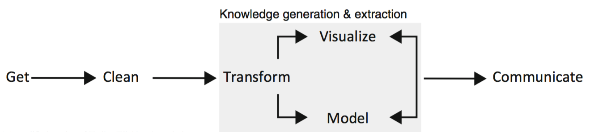

```

## Operaciones sobre datos
- Cargar datos *crudos*/Guardar datos finales y tablas de interés.
- Filtrar datos (con criterio).
- Unir datos que vienen de diferentes fuentes, referentes a un mismo conjunto estudiado.
- Hacer modificaciones: crear *tags*, correcciones ortográficas, filas y columnas de tablas, etc...
- Generar nuevos datos: obtener promedios, medianas, aplicar funciones de librerías.
- Dejar anotado y reportar lo hecho.

## 
\begin{tikzpicture}[remember picture,overlay]
  \node[anchor=south west,inner sep=0pt] at ($(current page.south west)+(0cm,7.8cm)$) {
     \includegraphics[width=1.5cm]{tidyverse.png}
  };
\end{tikzpicture}

```{r, echo = FALSE, eval = F, message=FALSE, width = "50%"}
library(knitr)
knitr::include_graphics('tidyverse.png')

```

```{r, echo = FALSE, eval = TRUE, message=FALSE}
library(knitr)

knitr::include_graphics('tidyverse_packages.png')
```


## 
\begin{tikzpicture}[remember picture,overlay]
  \node[anchor=south west,inner sep=0pt] at ($(current page.south west)+(0cm,7.8cm)$) {
     \includegraphics[width=1.5cm]{tibbles.png}
  };
\end{tikzpicture}

```{r, echo = TRUE, eval = TRUE, message=FALSE, size = 'small'}
library(tibble)

as_tibble(iris)
```


## 
\begin{tikzpicture}[remember picture,overlay]
  \node[anchor=south west,inner sep=0pt] at ($(current page.south west)+(0cm,7.8cm)$) {
     \includegraphics[width=1.5cm]{dplyr.png}
  };
\end{tikzpicture}

```{r, echo = FALSE, eval = F, message=FALSE}
library(knitr)

knitr::include_graphics('join-setup.png')
knitr::include_graphics('join-setup2.png')
knitr::include_graphics('join-inner.png')
knitr::include_graphics('join-outer.png')
knitr::include_graphics('join-venn.png')
knitr::include_graphics('transform-logical.png')
```


```{r, echo = FALSE, eval = F, message=FALSE}
library(knitr)

knitr::include_graphics('dplyr_funciones.png')
```

```{r, echo = FALSE, eval = T, message=FALSE}
library(knitr)


```

```{r, echo = FALSE, eval = T, message=FALSE}
library(knitr)


```

##

\begin{tikzpicture}[remember picture,overlay]
  \node[anchor=south west,inner sep=0pt] at ($(current page.south west)+(0cm,7.8cm)$) {
     \includegraphics[width=1.5cm]{dplyr.png}
  };
\end{tikzpicture}

```{r, echo = FALSE, eval = T, message=FALSE, out.width="50%", fig.align='center'}
library(knitr)

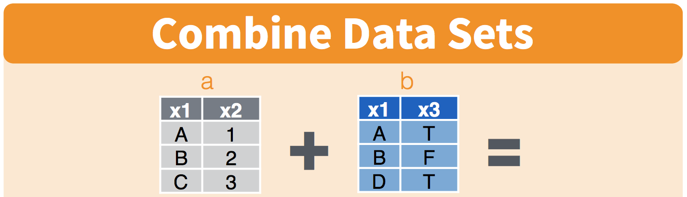
```

```{r, echo = FALSE, eval = T, message=FALSE, out.width="40%", fig.align='center'}
library(knitr)
library(magick)
library(cowplot)

p1 = ggdraw() + draw_image('comb_dplyr1.png')
p2 = ggdraw() + draw_image('comb_dplyr2.png')
plot_grid(p1,p2)
```

```{r, echo = FALSE, eval = T, message=FALSE, out.width="40%", fig.align='center'}
library(knitr)
library(magick)
library(cowplot)

p1 = ggdraw() + draw_image('comb_dplyr1.png')
p2 = ggdraw() + draw_image('comb_dplyr2.png')
plot_grid(p1,p2)
```

##

\begin{tikzpicture}[remember picture,overlay]
  \node[anchor=south west,inner sep=0pt] at ($(current page.south west)+(0cm,7.8cm)$) {
     \includegraphics[width=1.5cm]{dplyr.png}
  };
\end{tikzpicture}

- Con dplyr es posible dividir el análisis de la tabla según una columna, y luego operar sobre en base a esto

```{r, echo = FALSE, eval = T, message=FALSE, out.width="100%", fig.align='center'}
library(knitr)

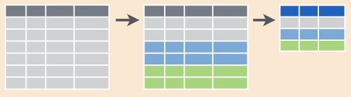
```


## Tablas... todas dan igual?

```{r, echo = FALSE, eval = F, message=FALSE, fig.align='right'}
library(knitr)

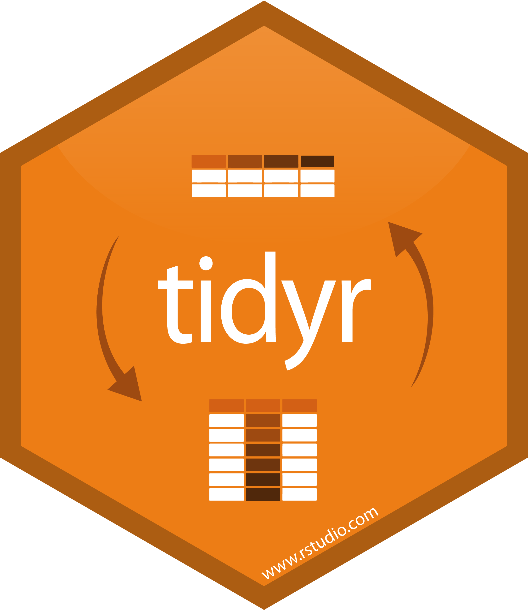
```

```{r, echo = FALSE, eval = T, message=FALSE, fig.align='center', out.width="70%"}
library(knitr)

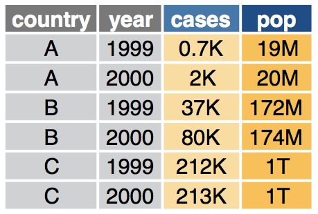
```

## Tablas... todas dan igual?

```{r, echo = FALSE, eval = T, message=FALSE, fig.align='center', out.width = "55%"}
library(knitr)

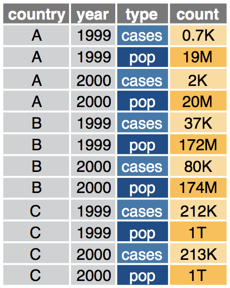
```

##

\begin{tikzpicture}[remember picture,overlay]
  \node[anchor=south west,inner sep=0pt] at ($(current page.south west)+(0cm,7.8cm)$) {
     \includegraphics[width=1.5cm]{tidyr.png}
  };
\end{tikzpicture}

- Podemos llevar una tabla a formato alargado

```{r, echo = FALSE, eval = T, message=FALSE, fig.align='right'}
library(knitr)

knitr::include_graphics('pivot_longer_detailed.png')
```

##

\begin{tikzpicture}[remember picture,overlay]
  \node[anchor=south west,inner sep=0pt] at ($(current page.south west)+(0cm,7.8cm)$) {
     \includegraphics[width=1.5cm]{tidyr.png}
  };
\end{tikzpicture}

- O llevarla a un formato ancho

```{r, echo = FALSE, eval = T, message=FALSE, fig.align='right'}
library(knitr)

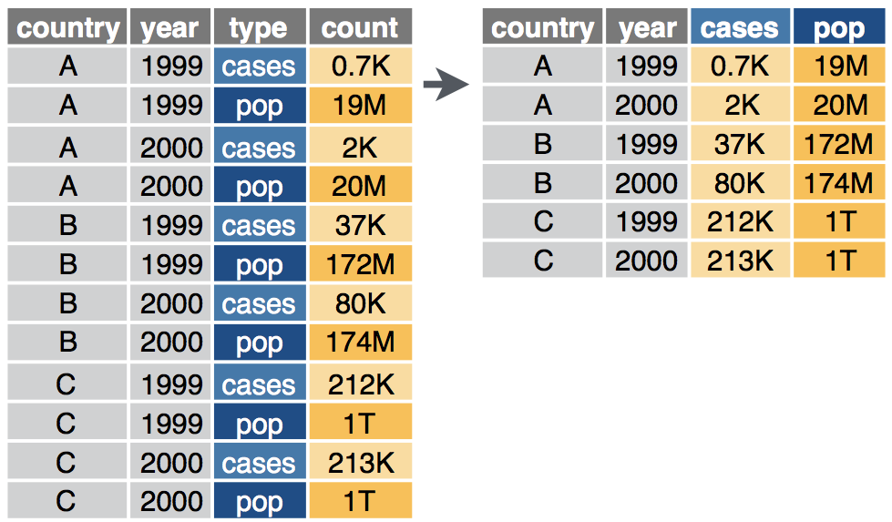
```

##

\begin{tikzpicture}[remember picture,overlay]
  \node[anchor=south west,inner sep=0pt] at ($(current page.south west)+(0cm,7.8cm)$) {
     \includegraphics[width=1.5cm]{tidyr.png}
  };
\end{tikzpicture}

- Podemos separar valores en celdas

```{r, echo = FALSE, eval = T, message=FALSE, fig.align='center', out.width = "60%"}
library(knitr)


```

- O unirlos

```{r, echo = FALSE, eval = T, message=FALSE, fig.align='center', , out.width = "60%"}
library(knitr)


```

## 
\begin{tikzpicture}[remember picture,overlay]
  \node[anchor=south west,inner sep=0pt] at ($(current page.south west)+(0cm,7.8cm)$) {
     \includegraphics[width=1.5cm]{ggplot2_logo.png}
  };
\end{tikzpicture}

- Es importante aca explicar cosas como lo de **aes()** y cosas del estilo. Para eso hay que leer bien un articulo sobre ggplot2!

## 

\begin{tikzpicture}[remember picture,overlay]
  \node[anchor=south west,inner sep=0pt] at ($(current page.south west)+(0cm,7.8cm)$) {
     \includegraphics[width=1.5cm]{ggplot2_logo.png}
  };
\end{tikzpicture}

```{r, echo = FALSE, eval = TRUE, message=FALSE}
library(knitr)

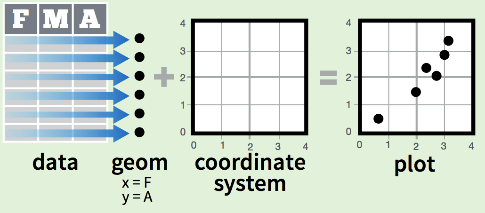
```

##


\begin{tikzpicture}[remember picture,overlay]
  \node[anchor=south west,inner sep=0pt] at ($(current page.south west)+(0cm,7.8cm)$) {
     \includegraphics[width=1.5cm]{ggplot2_logo.png}
  };
\end{tikzpicture}

```{r, echo = FALSE, eval = TRUE, message=FALSE}
library(knitr)

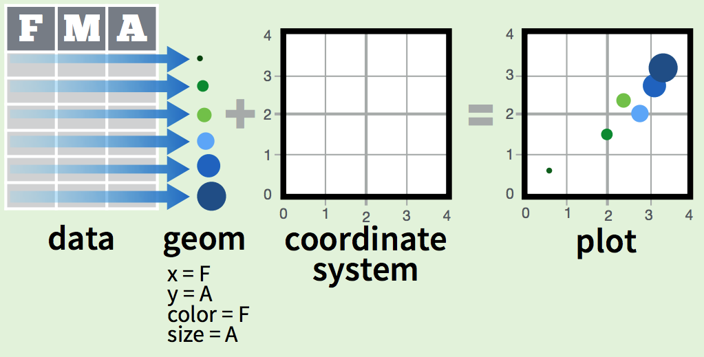
```


##

\begin{tikzpicture}[remember picture,overlay]
  \node[anchor=south west,inner sep=0pt] at ($(current page.south west)+(0cm,7.8cm)$) {
     \includegraphics[width=1.5cm]{ggplot2_logo.png}
  };
\end{tikzpicture}

```{r, echo = T, eval = F, message=FALSE}
library(tidyverse)
  # se grafica Sepal.Length vs Sepal.Width,
  # coloreando segun Species
ggplot(data = iris,
          aes(x = Sepal.Length, 
              y = Sepal.Width, 
              color = Species, 
              fill = Species)) +
  # se grafica utilizando puntos
  geom_point() 
```


##

\begin{tikzpicture}[remember picture,overlay]
  \node[anchor=south west,inner sep=0pt] at ($(current page.south west)+(0cm,7.8cm)$) {
     \includegraphics[width=1.5cm]{ggplot2_logo.png}
  };
\end{tikzpicture}

```{r, echo = FALSE, eval = TRUE, message=FALSE}
library(tidyverse)
  # se grafica Sepal.Length vs Sepal.Width,
  # coloreando segun Species
ggplot(data = iris,
          aes(x = Sepal.Length, 
              y = Sepal.Width, 
              color = Species, 
              fill = Species)) +
  # se grafica utilizando puntos
  geom_point() 
```

## 

```{r, echo = FALSE, eval = TRUE, message=FALSE}
library(knitr)

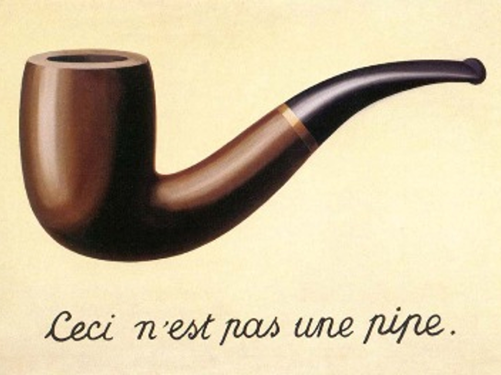
```

## 
\begin{tikzpicture}[remember picture,overlay]
  \node[anchor=south west,inner sep=0pt] at ($(current page.south west)+(0cm,7.8cm)$) {
     \includegraphics[width=1.5cm]{magrittr_log.jpg}
  };
\end{tikzpicture}

```{r, echo = FALSE, eval = F, message=FALSE}
library(knitr)

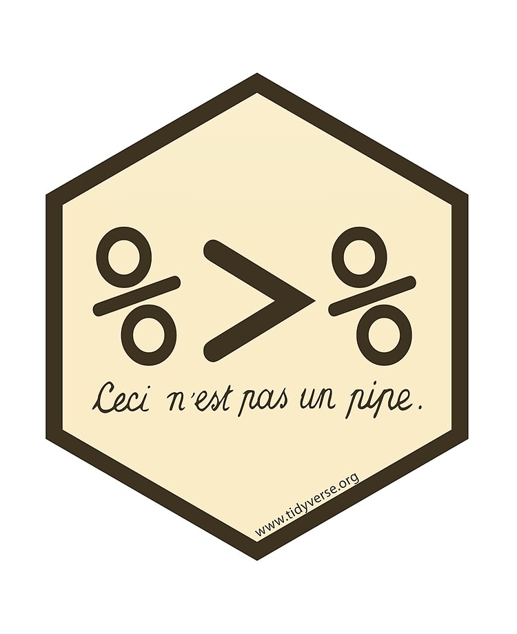
```

- Es el *pipe* de R.
- El uso es exactamente igual al '|' de Bash. 
- Un único detalle: se utiliza **.** para hacer referencia a resultados intermedios en un pipe.

##
\begin{tikzpicture}[remember picture,overlay]
  \node[anchor=south west,inner sep=0pt] at ($(current page.south west)+(0cm,7.8cm)$) {
     \includegraphics[width=1.5cm]{magrittr_log.jpg}
  };
\end{tikzpicture}

```{r, echo = TRUE, eval = TRUE, message=FALSE}
# con magrittr
library(magrittr)

Sepal.Width.Median = iris %>% .$Sepal.Width %>% median(.) 
```


## ¿Donde encuentro info sobre estos paquetes?
- Cheatsheets
- Vignettes

## ¿Donde encuentro info sobre estos paquetes?
```{r, echo = FALSE, eval = T, message=FALSE, out.width = "45%", fig.align='center'}
library(knitr)
knitr::include_graphics('cover_rfordatascience.png')

```


# Bonus

## GGally: análisis exploratorios y otros
```{r, echo = FALSE, eval = TRUE, message=FALSE, size="small"}
library(GGally)
data(psychademic)
psych_variables <- attr(psychademic, "psychology")
academic_variables <- attr(psychademic, "academic")
ggpairs(psychademic, academic_variables, title = "Within Academic Variables")
```

## Filogenética: librería ggtree
```{r, echo = FALSE, eval = TRUE, message=FALSE, size = "small"}
library(ggtree)

data(iris)
rn <- paste0(iris[,5], "_", 1:150)
rownames(iris) <- rn
d_iris <- dist(iris[,-5], method="man")

tree_iris <- ape::bionj(d_iris)
grp <- list(setosa     = rn[1:50],
            versicolor = rn[51:100],
            virginica  = rn[101:150])

p_iris <- ggtree(tree_iris, layout = 'circular', branch.length='none')
groupOTU(p_iris, grp, 'Species') + aes(color=Species) +
  theme(legend.position="right")
```

```{r, echo = FALSE, eval = FALSE, message=FALSE}
library(ggtree)

tree <- read.tree("data/tree.nwk")
p <- ggtree(tree) + geom_tiplab(size=3)
msaplot(p, "data/sequence.fasta", offset=3, width=2)
```

## Genómica: BioCircos/**rcirclize** y gggnomics, ggbio

```{r, echo = FALSE, eval = T, message=FALSE, out.width = "95%", fig.align='center'}
library(knitr)
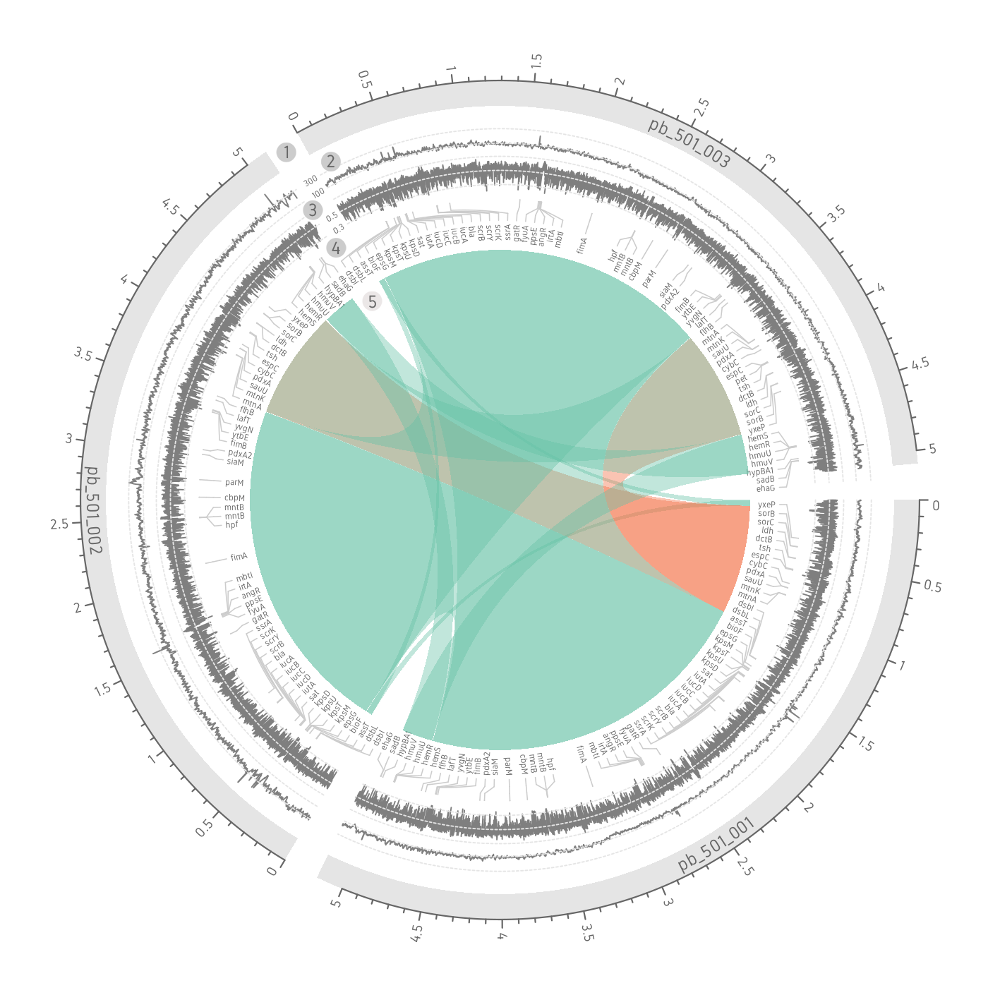

```

## Genómica: BioCircos/rcirclize y gggnomics, **ggbio**

```{r, echo = FALSE, eval = T, message=FALSE, out.width = "95%", fig.align='center'}
library(knitr)
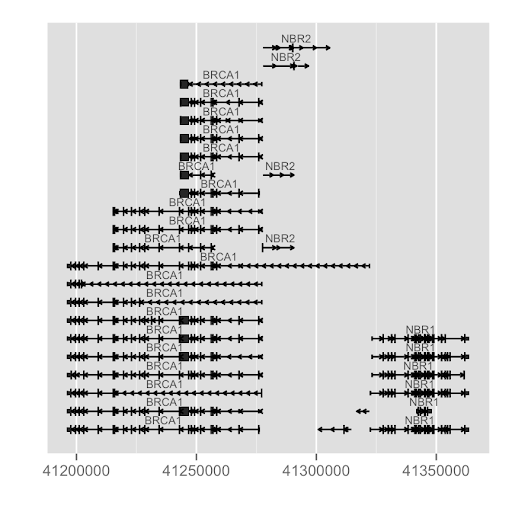

```

## Genómica: BioCircos/rcirclize y gggnomics, **ggbio**

```{r, echo = FALSE, eval = T, message=FALSE, out.width = "95%", fig.align='center'}
library(knitr)
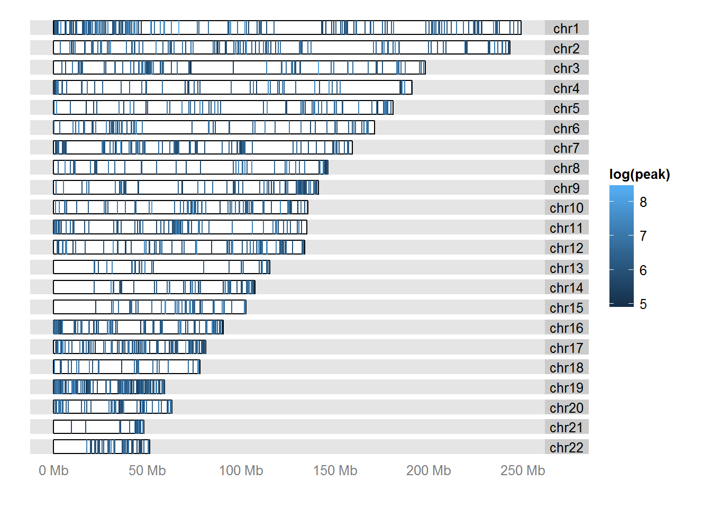

```