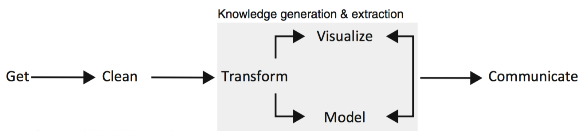

```{r, echo = F, eval = T}
library(emo)
library(tufte)
```

```{r, echo = F, eval = T}
library(knitr)
hook_output <- knit_hooks$get("output")
knit_hooks$set(output = function(x, options) {
  lines <- options$output.lines
  if (is.null(lines)) {
    return(hook_output(x, options))  # pass to default hook
  }
  x <- unlist(strsplit(x, "\n"))
  more <- "..."
  if (length(lines)==1) {        # first n lines
    if (length(x) > lines) {
      # truncate the output, but add ....
      x <- c(head(x, lines), more)
    }
  } else {
    x <- c(more, x[lines], more)
  }
  # paste these lines together
  x <- paste(c(x, ""), collapse = "\n")
  hook_output(x, options)
})

def.chunk.hook  <- knitr::knit_hooks$get("chunk")
knitr::knit_hooks$set(chunk = function(x, options) {
  x <- def.chunk.hook(x, options)
  ifelse(options$size != "normalsize", paste0("\n \\", options$size,"\n\n", x, "\n\n \\normalsize"), x)
})

```

```{r, eval = F, echo = F}
library(knitr)
hook_output = knit_hooks$get('output')
knit_hooks$set(output = function(x, options) {
  # this hook is used only when the linewidth option is not NULL
  if (!is.null(n <- options$linewidth)) {
    x = knitr:::split_lines(x)
    # any lines wider than n should be wrapped
    if (any(nchar(x) > n)) x = strwrap(x, width = n)
    x = paste(x, collapse = '\n')
  }
  hook_output(x, options)
})
```

```{r, echo = F, eval = T}
library(knitr)
error_hook <- knitr::knit_hooks$get("error")
knitr::knit_hooks$set(error = function(x, options) {
  if (!is.null(n <- options$linewidth)) {
    x = knitr:::split_lines(x)
    if (any(nchar(x) > n)) x = strwrap(x, width = n)
    x = paste(x, collapse = '\n')
  }
  error_hook(x, options)
})
```

# Que vamos a hacer?

## Manejo de datos y análisis reproducible

```{r, echo = FALSE, eval = T, message=FALSE, width = "50%"}
library(knitr)


```

\vspace{60pt}

\raggedleft \small [Data Wrangling with R (Boehmke, 2016)](http://93.174.95.29/_ads/6F902E466A32011DD94E2B6EEE505F9F)

## Análisis reproducible en R

```{r, echo = FALSE, eval = T, message=FALSE, width = "50%"}
library(knitr)


```

\raggedleft \small [Ciencia reproducible: qué, por qué, cómo (Rodríguez-Sánchez et al., 2016)](https://revistaecosistemas.net/index.php/ecosistemas/article/view/1178)


## Manejo de datos

-   ***Data wrangling***: es el proceso mediante el cual modificamos datos iniciales con el fin de analizarlos.
\vspace{15pt}
-   Incluye la edición, el filtrado, la obtención de nuevos valores y más.
\vspace{15pt}
-   *"In our experience, the tasks of exploratory data mining and data cleaning constitute 80% of the effort that determines 80% of the value of the ultimate data mining results. (...)"*. \\ **Dasu & Johnson.** *Exploratory Data Mining and Data Cleaning* (2003).

## Estructura de las clases

-   Teórico/práctico.
\vspace{12pt}
-   Práctico 11: repaso de loops y armado de funciones en R

    -   accionar sobre los datos para transformarlos: funciones
    -   realizar acciones repetitivas: loops
\vspace{12pt}
-   Práctico 12: manejo de datos con paquetes de la librería **tidyverse**.

    -   filtrado y edición de datos
    -   visualización de los datos

# Breve repaso de R

## Breve repaso
```{r, echo = FALSE, eval = T, message=FALSE, width = "50%"}
library(knitr)

```

\vspace{50pt}

\raggedleft \small [A practical guide to the R package Luminescence (Dietze et al., 2013)](https://hal.archives-ouvertes.fr/hal-01846155/document)

## Breve repaso

```{r, echo = FALSE, eval = T, message=FALSE, out.width = "60%", fig.align='center'}
library(knitr)

```

\raggedleft \small [Control Structures in R (R-Bloggers)](https://www.r-bloggers.com/control-structures-loops-in-r/)

## Breve repaso

```{r, echo = FALSE, eval = T, message=FALSE, width = "50%"}
library(knitr)

```
\vspace{15pt}
\raggedleft \small [R Base Graphs: an Idiot's Guide](https://rpubs.com/SusanEJohnston/7953)

# Funciones en R

## Funciones: una parte central de R

-   Qué es una función? Un conjunto de **operaciones** definidas que toman **argumentos** para dar un resultado.

-   R Es un lenguaje de programación en base a funciones: casi todo lo que hacemos las utiliza.

    -   Otros lenguajes operan de forma diferente.

-   Ventajas

    -   Le podemos dar nombre descriptivo
    -   Nos ahorramos copiar y pegar codigo varias veces (y errar en el proceso)
    -   Si hay que cambiar algo, es solo cambiar la funcion

-   Las funciones en R salen de muchos lados:

    -   R tiene funciones que vienen incorporadas por defecto
    -   Utilizando librerías obtenemos nuevas funciones (como las de **seqinr**, por ejemplo)
    -   Nosotros podemos hacer nuestras propias funciones

## Ejemplo de una función
En la clase pasada operaron sobre variables que alojaban secuencias, utilizando funciones como la funcion **GC** de la libreria seqinr
\vspace{15pt}

```{r, echo = FALSE, eval = TRUE, message=TRUE, out.height="50%", output.lines = 5}
library(seqinr)
secuencia = s2c(c('ATGCGTGTCTC'))
```

```{r, echo = TRUE, eval = TRUE, message=TRUE, out.height="50%", output.lines = 5}
library(seqinr)

seqinr::GC(secuencia)
```

\vspace{15pt}
Como funciona esto?

## Componentes de una función

-   **cuerpo**: el código que define a la función
\vspace{12pt}

-   **formales**: la lista de argumentos que controlan cómo se llama a la función
\vspace{12pt}

-   **ambiente**: el "mapa" de la locación de las variables de la función

    -   Es la unica que se define implicitamente, dependiendo de donde uno define la funcion


## Componentes de una función

```{r, echo = TRUE, eval = TRUE, message=TRUE, out.height="50%", output.lines = 5}
library(seqinr)

body(seqinr::GC)
```

Toda funcion tiene que especificar como hace lo que hace en algun lugar...

## Componentes de una función

```{r, echo = TRUE, eval = TRUE, message=TRUE, output.lines = 10}
library(seqinr)

formals(seqinr::GC)
```

Los argumentos tambien se alojan en algun lugar.

## Componentes de una función

```{r, echo = TRUE, eval = TRUE, message=TRUE, output.lines = 10}
library(seqinr)

environment(seqinr::GC)
```

La funcion va a buscar, en primer lugar, variables definidas en el ambiente "seqinr". 

## Definición de funciones

Nosotros podemos hacer nuestras propias funciones, a medida de lo que necesitamos.
\vspace{15pt}

```{r, echo = TRUE, eval = FALSE, message=FALSE}
mi_funcion = function(argumento_1, argumento_2, ...){
#<-> el indentado no es obligatorio, pero ayuda a leer  
  # en este bloque suceden operaciones con argumento_1
  ...
  # en este bloque suceden operaciones con argumento_2
  ...
  # se devuelve algo como resultado de aplicar
  # la funcion a los argumentos
  return(una_variable_nueva) 
} # una linea sola para este parentesis ayuda a leer
```

## Definición de funciones

Hagamos una funcion que opere con dos numeros cualesquiera, *x* e *y*.
\vspace{15pt}

```{r, echo = TRUE, eval = TRUE, message=FALSE}
eleva_y_resta = function(x,y){
  resultado = x^2 - y^2
  return(resultado)
}
```

## Definición de funciones

Hagamos una funcion que opere con dos numeros cualesquiera, *x* e *y*.
\vspace{15pt}
```{r, echo = TRUE, eval = TRUE, message=FALSE}
eleva_y_resta = function(x,y){
  resultado = x^2 - y^2
  return(resultado)
}

eleva_y_resta(2,3)
```
\vspace{15pt}
Puedo pasar argumentos sin especificarlos explicitamente. Se interpreta el valor de cada argumento segun el orden de entrada.

## Definición de funciones

Hagamos una funcion que opere con dos numeros cualesquiera, *x* e *y*.
\vspace{15pt}
```{r, echo = TRUE, eval = TRUE, message=FALSE}
eleva_y_resta = function(x,y){
  resultado = x^2 - y^2
  return(resultado)
}

eleva_y_resta(y = 2, x =3)
```

## Definición de funciones

Hagamos una funcion que opere con dos numeros cualesquiera, *x* e *y*.
\vspace{15pt}
```{r setup, cache = F, eval = T, echo = F}
knitr::opts_chunk$set(error = TRUE)
```

```{r, echo = TRUE, eval = TRUE, message=TRUE}
eleva_y_resta = function(x,y){
  resultado = x^2 - y^2
  return(resultado)
}

eleva_y_resta(y = 2)
```
\vspace{15pt}
Si un argumento utilizado en la funcion no tiene un valor asignado, sucede un error!

## Las funciones estan en todos lados...

"Para entender el computo en *R*, dos sloganes son utiles:

- Todo lo que existe es un objeto.

- Todo sucede llamando a una funcion."

`r tufte::quote_footer('--- Joe Chambers')`

\vspace{12pt}


En R usamos funciones hasta sin saberlo

```{r, echo = T, eval = T}
un_vector = c(1, 4, 6) # una funcion me permitio hacer esto
un_vector[1] # y tambien una funcion me permitio hacer esto
```

\vspace{12pt}

Tanto **c**, como **=**, como **[** son funciones, aunque no lo parezcan.


## Las funciones estan en todos lados...

```{r, echo = TRUE, eval = TRUE, message=TRUE}
`[`

`for`

`c`
```
\vspace{12pt}

Son funciones llamadas *primitivas*. Estan escritas en el lenguaje C de programacion, y no podemos acceder a su codigo.

# Loops en R

## For loop (abstracto)

En las clases anteriores vieron estructuras del estilo:
\vspace{15pt}

```{r, echo = TRUE, eval = FALSE, message=FALSE}
# for loop

un_vector = ...
for (i in ____) {
  ...
  ... un_vector[i] ....
  ...
}
```

\vspace{15pt}

En R los loops utilizan indices para acceder a elementos de un vector/lista

## For loop (la logica)

```{r, echo = FALSE, eval = T, message=FALSE, out.width = "90%", fig.align='center'}
library(knitr)

```

## For loop (la logica)

```{r, echo = FALSE, eval = T, message=FALSE, out.width = "90%", fig.align='center'}
library(knitr)

```

## For loop (la logica)

```{r, echo = FALSE, eval = T, message=FALSE, out.width = "90%", fig.align='center'}
library(knitr)
knitr::include_graphics('images/explicando_forloops_en_r_0c.png')
```

## For loop (la logica)

```{r, echo = FALSE, eval = T, message=FALSE, out.width = "90%", fig.align='center'}
library(knitr)
knitr::include_graphics('images/explicando_forloops_en_r_0d.png')
```

## For loop (la logica)

```{r, echo = FALSE, eval = T, message=FALSE, out.width = "90%", fig.align='center'}
library(knitr)

```

## For loop (la logica)

```{r, echo = FALSE, eval = T, message=FALSE, out.width = "90%", fig.align='center'}
library(knitr)

```

## For loop (la logica)

```{r, echo = FALSE, eval = T, message=FALSE, out.width = "90%", fig.align='center'}
library(knitr)

```

## For loop (ejemplo con codigo)

```{r, echo = TRUE, eval = FALSE, message=FALSE}
numeros = c(3,40,15,6)
numeros_cuadrado = c()

for (i in 1:length(numeros)) {
  numeros_cuadrado[i] = numeros[i]^2
}
```

## Funciones \*apply(): otra forma de *loopear*
Son *funciones de alto rango*: uno de sus argumentos es otra funcion, la cual aplican sobre un objeto.

```{r, echo = TRUE, eval = TRUE, message=TRUE, linewidth = 10, error = T, size = 'small'}
# definimos un vector
numeros = c(1,2,3,4)

# aplicamos una funcion anonima sobre este vector
numeros_cuadrado = sapply(X = numeros, FUN = function(x){x^2})

numeros_cuadrado
```

\vspace{12pt}

Tenemos varias opciones, que dan diferentes clases de salidas: sapply (vectores), lapply (listas), mapply (matrices).

# Comentarios, dudas existenciales?

## A programar se ha dicho :)

```{r, echo = F, eval = F}
library(emo)
emo::ji('smile')
```

-   10 minutos de pausa y volvemos.
\vspace{20pt}
-   El practico de hoy esta en [este link](https://rpubs.com/mlangleib/797813) (clickear).

