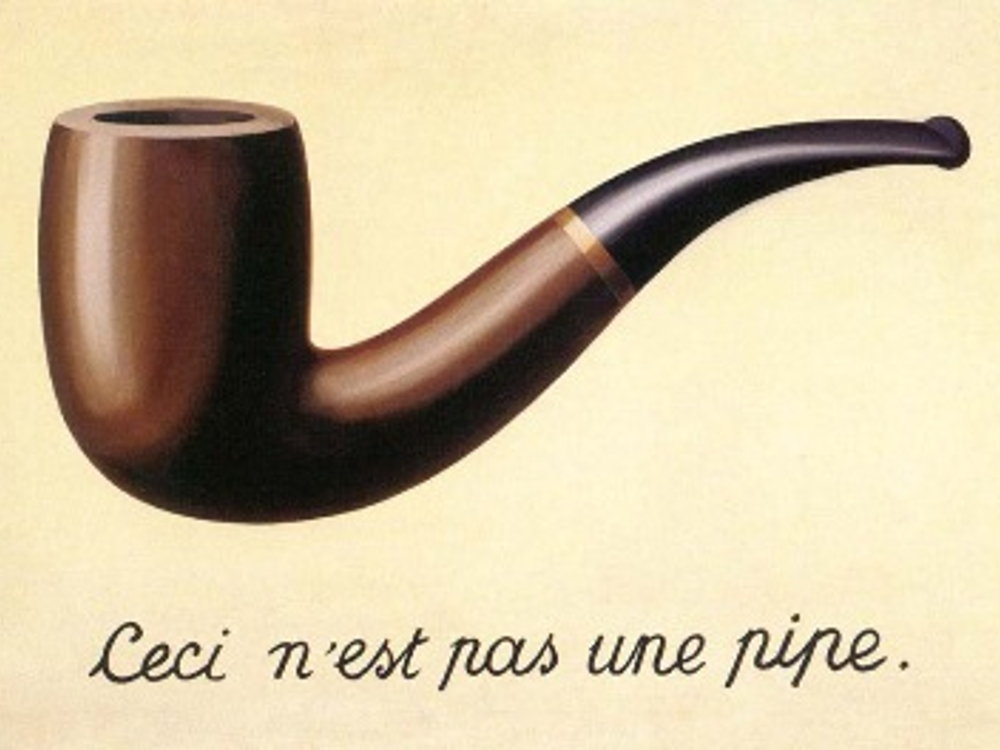
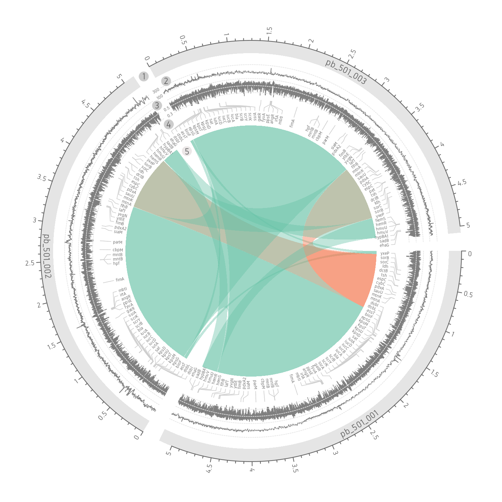

```{r, echo = F, eval = T}
library(knitr)
hook_output <- knit_hooks$get("output")
knit_hooks$set(output = function(x, options) {
  lines <- options$output.lines
  if (is.null(lines)) {
    return(hook_output(x, options))  # pass to default hook
  }
  x <- unlist(strsplit(x, "\n"))
  more <- "..."
  if (length(lines)==1) {        # first n lines
    if (length(x) > lines) {
      # truncate the output, but add ....
      x <- c(head(x, lines), more)
    }
  } else {
    x <- c(more, x[lines], more)
  }
  # paste these lines together
  x <- paste(c(x, ""), collapse = "\n")
  hook_output(x, options)
})

def.chunk.hook  <- knitr::knit_hooks$get("chunk")
knitr::knit_hooks$set(chunk = function(x, options) {
  x <- def.chunk.hook(x, options)
  ifelse(options$size != "normalsize", paste0("\n \\", options$size,"\n\n", x, "\n\n \\normalsize"), x)
})

```

```{r, eval = F, echo = F}
library(knitr)
hook_output = knit_hooks$get('output')
knit_hooks$set(output = function(x, options) {
  # this hook is used only when the linewidth option is not NULL
  if (!is.null(n <- options$linewidth)) {
    x = knitr:::split_lines(x)
    # any lines wider than n should be wrapped
    if (any(nchar(x) > n)) x = strwrap(x, width = n)
    x = paste(x, collapse = '\n')
  }
  hook_output(x, options)
})
```

```{r, echo = F, eval = T}
library(knitr)
error_hook <- knitr::knit_hooks$get("error")
knitr::knit_hooks$set(error = function(x, options) {
  if (!is.null(n <- options$linewidth)) {
    x = knitr:::split_lines(x)
    if (any(nchar(x) > n)) x = strwrap(x, width = n)
    x = paste(x, collapse = '\n')
  }
  error_hook(x, options)
})
```

# Breve repaso

## Algunas ventajas de usar *R*

-   Lenguaje potente pero de relativa facil entradac
\vspace{10pt}
-   Buena integracion de:

    -   importe de datos de diferente formato
    -   edicion y filtrado de datos
    -   visualizacion/modelado de datos (analisis exploratorio)
    -   comunicacion de resultados (RMarkdown)

\vspace{10pt}
-   Es particularmente popular en biologia computacional (especialmente eco-evo y genomicas)
\vspace{10pt}
-   Queremos hacer graficos de alta calidad!

```{r, echo = F, eval = T}
par(mar=c(0,0,0,0)) #it's important to have that in a separate chunk
``` 

```{r, echo = FALSE, eval = F, message=FALSE, out.width="65%", fig.align='center', fig.show='hold'}
library(knitr)
library(magick)
library(cowplot)

p1 = ggdraw() + draw_image('../../imgs/ejemplo_ggplot2_1.png')
p2 = ggdraw() + draw_image('../../imgs/ejemplo_ggplot2_2.png')
p3 = ggdraw() + draw_image('../../imgs/ejemplo_ggplot2_3.png')
plot_grid(p1,p2,p3, ncol = 3)
```


## Manejo de datos y análisis reproducible

```{r, echo = FALSE, eval = T, message=FALSE, width = "50%"}
library(knitr)
knitr::include_graphics('../../imgs/analytic_process.png')

```

\vspace{60pt}

\raggedleft \small [Data Wrangling with R (Boehmke, 2016)](http://93.174.95.29/_ads/6F902E466A32011DD94E2B6EEE505F9F)

## Operaciones sobre datos

-   Cargar datos *crudos*/Guardar datos finales y tablas de interés.
\vspace{10pt}
-   Filtrar datos (con criterio).
\vspace{10pt}
-   Unir datos que vienen de diferentes fuentes, referentes a un mismo conjunto estudiado.
\vspace{10pt}
-   Hacer modificaciones: crear *tags*, correcciones ortográficas, filas y columnas de tablas, etc...
\vspace{10pt}
-   Generar nuevos datos: obtener promedios, medianas, aplicar funciones de librerías.
\vspace{10pt}
-   Visualiar/modelar datos
\vspace{10pt}
-   Dejar anotado y reportar lo hecho.

# *tidyverse*: una forma de programar en *R*

## 

```{=tex}
\begin{tikzpicture}[remember picture,overlay]
  \node[anchor=south west,inner sep=0pt] at ($(current page.south west)+(0cm,7.8cm)$) {
     \includegraphics[width=1.5cm]{../../imgs/tidyverse.png}
  };
\end{tikzpicture}
```
```{r, echo = FALSE, eval = F, message=FALSE, width = "50%"}
library(knitr)
knitr::include_graphics('../../imgs/tidyverse.png')

```

```{r, echo = FALSE, eval = TRUE, message=FALSE}
library(knitr)

knitr::include_graphics('../../imgs/tidyverse_packages.png')
```

-   Hay librerias del universo *tidyverse* para cada paso clave de analisis de datos.
-   Hay, ademas, librerias con su logica para analisis especificos: estadistica, modelado de datos, filogenetica, genomica, etc...

## *tidy* data
"*Tidy*" en ingles significa "ordenado", de ahi el nombre de la libreria.

```{r, echo = FALSE, eval = T, message=FALSE, width = "25%", fig.align='center'}
library(knitr)

knitr::include_graphics('../../imgs/tidy_data_specification.png')
```

- Caracteristicas de *tidy* data:
  + Cada fila corresponde a una observacion 
  + Cada columna corresponde a una variable

- **Ventajas**:
  + Estandarizacion
  + Se basa, y le saca jugo, a la logica vectoria de *R*
  + Ya tenemos todos los paquetes de *tidyverse* para trabajar arriba de la *tidy* data! (y generarla). 

## Operaciones sobre datos (con *tidyverse*)

-   Cargar datos *crudos*/Guardar datos finales y tablas de interés. (**readr**)
\vspace{10pt}
-   Filtrar datos (con criterio). (**dplyr**)
\vspace{10pt}
-   dplyr.svg Unir datos que vienen de diferentes fuentes, referentes a un mismo conjunto estudiado. (**dplyr**)
\vspace{10pt}
-   Hacer modificaciones: crear *tags*, correcciones ortográficas, filas y columnas de tablas, etc... (**tidyr**)
\vspace{10pt}
-   magrittr_logo.png dplyr.png Generar nuevos datos: obtener promedios, medianas, aplicar funciones de librerías. (**magrittr** \+ **dplyr**)
\vspace{10pt}
-   Visualiar/modelar datos (**ggplot2** + **tidymodels**)
\vspace{10pt}
-   Dejar anotado y reportar lo hecho. (**rmarkdown**, **blogdown**)


## 

```{=tex}
\begin{tikzpicture}[remember picture,overlay]
  \node[anchor=south west,inner sep=0pt] at ($(current page.south west)+(0cm,7.8cm)$) {
     \includegraphics[width=1.5cm]{../../imgs/tibbles.png}
  };
\end{tikzpicture}
```

```{r, echo = TRUE, eval = TRUE, message=FALSE, size = 'scriptsize', out.height="50%"}
library(tibble)

as_tibble(iris)
```

- En *tidyverse* se suele trabajar sobre tablas en formato *tidy*, alojadas en objetos de clase **tibble**
- A las mismas se le aplican varios procesos

## 

```{=tex}
\begin{tikzpicture}[remember picture,overlay]
  \node[anchor=south west,inner sep=0pt] at ($(current page.south west)+(0cm,7.8cm)$) {
     \includegraphics[width=1.5cm]{../../imgs/magrittr_log.jpg}
  };
\end{tikzpicture}
```
```{r, echo = FALSE, eval = F, message=FALSE}
library(knitr)


```

```{r, echo = FALSE, eval = TRUE, message=FALSE, out.height='60%', fig.align='center'}
library(knitr)


```


-   Es el *pipe* de R.
-   El uso es exactamente igual al '\|' de Bash.
-   Un único detalle: se utiliza **.** para hacer referencia a resultados intermedios en un pipe.


## Operando secuencialmente sobre un dataset
```{r, echo = T, eval = F, size='scriptsize'}
# cargo las librerias que utilizamos en el practico
library(magrittr)
library(tidyverse)

# cargo tabla CSV, separo datos de una columna y filtro datos de una columna
aeropuertos_tibble = readr::read_csv('airport-codes.csv') %>%
  tidyr::separate(data = ., 
                  col = 'coordinates', 
                  into = c('lon', 'lat'), 
                  sep = ', ') %>%
  dplyr::filter(is.na(iso_country))

```

Esta logica secuencial es sumamente practica. Pueden verla en accion si siguen [este link a clase de practico](https://rpubs.com/mlangleib/linea_comandos_practico_12), junto a otras utilidades de *tidyverse*.

# Gramatica de graficos en capas

## 

```{=tex}
\begin{tikzpicture}[remember picture,overlay]
  \node[anchor=south west,inner sep=0pt] at ($(current page.south west)+(0cm,7.8cm)$) {
     \includegraphics[width=1.5cm]{../../imgs/ggplot2_logo.png}
  };
\end{tikzpicture}
```

La idea central es que un grafico puede ser construido a traves de capas de elementos.

```{r, echo = FALSE, eval = TRUE, message=FALSE, fig.align='center', out.width="72%"}
library(knitr)


```


## 

```{=tex}
\begin{tikzpicture}[remember picture,overlay]
  \node[anchor=south west,inner sep=0pt] at ($(current page.south west)+(0cm,7.8cm)$) {
     \includegraphics[width=1.5cm]{../../imgs/ggplot2_logo.png}
  };
\end{tikzpicture}
```

La idea central es que un grafico puede ser construido a traves de capas de elementos.

-   Para realizar un gráfico preciso especificar:

    -   Los **datos** sobre los que trabajo
\vspace{10pt}
    -   Un sistema de coordenadas
\vspace{10pt}
    -   Una especificación de qué representa cada dato a nivel **estético**
\vspace{10pt}
    -   Una **forma geométrica** para representar estos datos
\vspace{10pt}
-   Además, podríamos considerar

    -   Especificar **funciones** que operen sobre nuestros datos, agrupándolos o transformándolos (pasa en histogramas, por ejemplo)
\vspace{10pt}
    -   **Subdivisiones** de nuestros datos en base a factores.
\vspace{10pt}


## 

```{=tex}
\begin{tikzpicture}[remember picture,overlay]
  \node[anchor=south west,inner sep=0pt] at ($(current page.south west)+(0cm,7.8cm)$) {
     \includegraphics[width=1.5cm]{../../imgs/ggplot2_logo.png}
  };
\end{tikzpicture}
```
-   Para realizar un gráfico preciso especificar:

    -   Los **datos** sobre los que trabajo $\rightarrow$ funcion **ggplot()**
\vspace{10pt}
    -   Un sistema de coordenadas $\rightarrow$ funcion **ggplot()**
\vspace{10pt}
    -   Una especificación de qué representa cada dato a nivel **estético** $\rightarrow$ funcion **aes()**
\vspace{10pt}
    -   Una **forma geométrica** para representar estos datos funciones $\rightarrow$  funciones **geom()**_\*
\vspace{10pt}

-   Además, podríamos considerar
\vspace{10pt}
    -   Especificar **funciones** que operen sobre nuestros datos, agrupándolos o transformándolos (pasa en histogramas, por ejemplo) $\rightarrow$ funcion **stat()**
\vspace{10pt}
    -   **Subdivisiones** de nuestros datos en base a factores. $\rightarrow$ funcion **facet_wrap**

## 

```{=tex}
\begin{tikzpicture}[remember picture,overlay]
  \node[anchor=south west,inner sep=0pt] at ($(current page.south west)+(0cm,7.8cm)$) {
     \includegraphics[width=1.5cm]{../../imgs/ggplot2_logo.png}
  };
\end{tikzpicture}
```
```{r, echo = FALSE, eval = TRUE, message=FALSE}
library(knitr)


```

## 

```{=tex}
\begin{tikzpicture}[remember picture,overlay]
  \node[anchor=south west,inner sep=0pt] at ($(current page.south west)+(0cm,7.8cm)$) {
     \includegraphics[width=1.5cm]{../../imgs/ggplot2_logo.png}
  };
\end{tikzpicture}
```
```{r, echo = FALSE, eval = TRUE, message=FALSE}
library(knitr)


```

## 

```{=tex}
\begin{tikzpicture}[remember picture,overlay]
  \node[anchor=south west,inner sep=0pt] at ($(current page.south west)+(0cm,7.8cm)$) {
     \includegraphics[width=1.5cm]{../../imgs/ggplot2_logo.png}
  };
\end{tikzpicture}
```
```{r, echo = T, eval = F, message=FALSE}
library(tidyverse)
  # se grafica Sepal.Length vs Sepal.Width,
  # coloreando segun Species
ggplot(data = iris,
       mapping = aes(x = Sepal.Length, 
              y = Sepal.Width, 
              color = Species, 
              fill = Species)) +
  # se grafica utilizando puntos
  geom_point() 
```

## 

```{=tex}
\begin{tikzpicture}[remember picture,overlay]
  \node[anchor=south west,inner sep=0pt] at ($(current page.south west)+(0cm,7.8cm)$) {
     \includegraphics[width=1.5cm]{../../imgs/ggplot2_logo.png}
  };
\end{tikzpicture}
```
```{r, echo = FALSE, eval = TRUE, message=FALSE}
library(tidyverse)
  # se grafica Sepal.Length vs Sepal.Width,
  # coloreando segun Species
ggplot(data = iris,
       mapping = aes(x = Sepal.Length, 
              y = Sepal.Width, 
              color = Species, 
              fill = Species)) +
  # se grafica utilizando puntos
  geom_point() 
```


## GGally: análisis exploratorios y otros

```{r, echo = FALSE, eval = TRUE, message=FALSE, size="small"}
library(GGally)
data(psychademic)
psych_variables <- attr(psychademic, "psychology")
academic_variables <- attr(psychademic, "academic")
ggpairs(psychademic, academic_variables, title = "Within Academic Variables")
```

## Filogenética: librería ggtree

```{r, echo = FALSE, eval = TRUE, message=FALSE, size = "small"}
library(ggtree)

data(iris)
rn <- paste0(iris[,5], "_", 1:150)
rownames(iris) <- rn
d_iris <- dist(iris[,-5], method="man")

tree_iris <- ape::bionj(d_iris)
grp <- list(setosa     = rn[1:50],
            versicolor = rn[51:100],
            virginica  = rn[101:150])

p_iris <- ggtree(tree_iris, layout = 'circular', branch.length='none')
groupOTU(p_iris, grp, 'Species') + aes(color=Species) +
  theme(legend.position="right")
```

```{r, echo = FALSE, eval = FALSE, message=FALSE, out.width="150%"}
library(ggtree)

tree <- read.tree("data/tree.nwk")
p <- ggtree(tree) + geom_tiplab(size=3)
msaplot(p, "data/sequence.fasta", offset=3, width=2)
```

## Genómica: BioCircos/**rcirclize** y gggnomics, ggbio

```{r, echo = FALSE, eval = T, message=FALSE, out.width = "70%", fig.align='center'}
library(knitr)


```

## Genómica: BioCircos/rcirclize y gggnomics, **ggbio**

```{r, echo = FALSE, eval = T, message=FALSE, out.width = "70%", fig.align='center'}
library(knitr)


```

## Genómica: BioCircos/rcirclize y gggnomics, **ggbio**

```{r, echo = FALSE, eval = T, message=FALSE, out.width = "95%", fig.align='center'}
library(knitr)


```

# Lugares interesantes para leer

## ¿Donde encuentro info sobre estos paquetes?

```{r, echo = FALSE, eval = T, message=FALSE, out.width = "45%", fig.align='center'}
library(knitr)
knitr::include_graphics('../../imgs/cover_rfordatascience.png')

```

La mejor puerta de entrada al universo *tidyverse* (y a buena parte de *R*!)

## ¿Donde encuentro info sobre estos paquetes?

- *Cheatsheets* y *Vignettes* de las librerias
\vspace{10pt}
- *From Data to Viz* [(link)](https://www.data-to-viz.com/): una buena pagina para ver como se hacen algunos graficos especificos
\vspace{10pt}
- Paginas con cursos cortos, en especial:
\vspace{10pt}

  + *Software carpentry* [(link)](https://software-carpentry.org/), con cursos en ingles y espanhol 
  \vspace{5pt}
  + *Our coding club* [(link)](https://ourcodingclub.github.io/), de un grupo de ecologia de Escocia
  \vspace{10pt}
- Papers del grupo de Hadley Wickham (creador de tidyverse).
  + Estan bastante a la mano (no son de programacion pura y dura), y ayudan a entender la logica de fondo
\vspace{10pt}
  + Paper sobre *Tidy data* ([link](https://vita.had.co.nz/papers/tidy-data.pdf))
\vspace{5pt}
  + Paper sobre *Layered grammar of graphics* ([link](https://byrneslab.net/classes/biol607/readings/wickham_layered-grammar.pdf))


